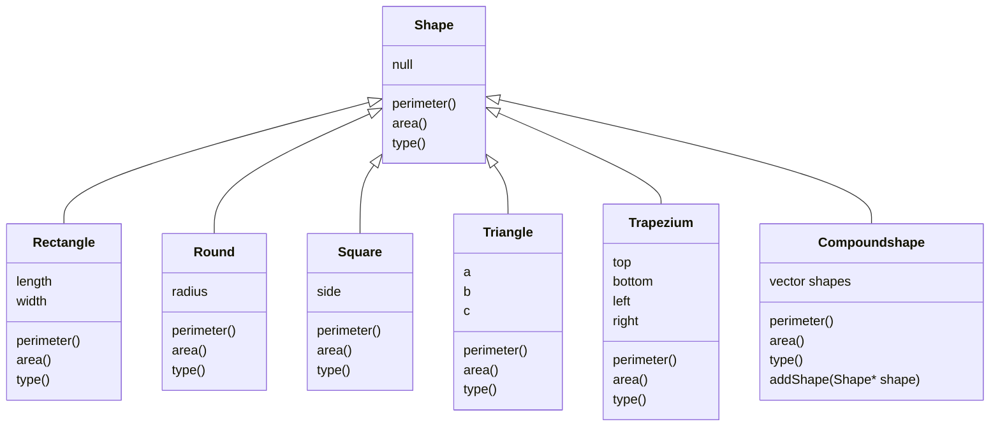

### 一、week01

#### 1、问题

使用C++语言编写一系列的类来实现形状相关的操作

要点如下：

- 设计一个抽象基类形状(Shape).这个抽象基类有周长、面积、形状类型等纯虚函数

- 具体形状有三角形(triangle，用三条边长表示)、正方形(square)、长方形(rectangle)、梯形(trapezium，用上底、下底和左右边长表示)、圆形(round)、复合形状(compoundshape)。这些形状都是由Shape派生
- 复合形状是指由多个形状组成的形状，组成复合形状的形状可以是普通形状，也可以是复合形状

- 一个复合形状的周长、面积都是它的各个子形状的和

要求：

运用类的派生、多态、组合等相关知识完成上述习题

**加分项**

考虑使用设计模式来完善题目

#### 2、设计

类之间的结构




各种图形的type使用枚举来标识

```c++
enum ShapeType {
    triangle, square, rectangle, trapezium, circle, compoundshape
};
```

#### 3、设计模式

- Builder模式

  Compoundshape由其他的形状组合而成，构造时参数可变，故选择Builder模式来构造

- Factory模式

  其余Shape派生类使用Factory模式来构建，参数在Factory中校验，例如构造三角形时判断三边能否构建一个三角形